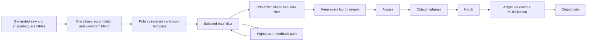

# Open303 engine analysis for Moj Sint

Implementation follow-up: the authorized [isolated candidate](OPEN303_CANDIDATE.md)
now provides the repaired, optional C++/Rust core and offline renderer. This
report preserves the upstream audit and initial probe evidence; candidate
behavior and current repairs are documented separately.

## Recommendation

Open303 is a credible candidate for **direct reuse of its C++ synthesis core**.
The DSP can be built without a plugin SDK, GUI, JACK, or ALSA, and a small C
interface is sufficient to call it from Rust. An offline comparison produced
byte-identical output through that interface and through direct C++ calls.
There is no demonstrated need to rewrite its oscillator, filter, and envelope
system merely to use it in Moj Sint.

The original core is **not ready for our live callback**. Construction contains
an out-of-bounds write, MIDI note storage allocates and frees memory, some
controls regenerate tables, and several initialization and note-state behaviors
need correction. These are concrete integration tasks, not reasons to abandon
reuse. Preserve a reference build, repair infrastructure separately from sound
changes, and introduce an isolated candidate before making it a production
model.

The useful inheritance is the whole interacting bass voice: oscillator shape,
filter envelope mapping, accent, slide, coupling filters, and amplitude contour.
Taking only its filter would discard much of that work. However, the active
`TB_303` filter implementation does not apply the nonlinear stage functions
present elsewhere in the file. Treat this as an empirically shaped digital
303-style instrument, not a verified full nonlinear circuit simulation.[^1][^2]

## Scope and revisions

The assessment date is 2026-09-09. The source baseline is Robin Schmidt's
Open303 revision `313bf0d9ade7c1dcb6b3a74f5ea1780a29d70074`, committed
2024-03-29. Its README describes continuation of the older SourceForge project
and an intended CLAP port. The checked source contains a VST2 wrapper; a planned
CLAP implementation is not a dependency or a prerequisite for core reuse.[^3]

The closely related JC-303 tree was compared at
`aa32761397001f783fb98aee773f45b38b86bc08`, committed 2025-11-20. This comparison
covers its Open303 DSP subtree and relevant declarations, not an audit of all
JUCE, graphics, overdrive, or neural-model dependencies.[^4]

Evidence has three levels throughout this report:

- **Source finding:** follows from the pinned implementation and its callers.
- **Probe result:** reproduced in the narrowly described offline experiment.
- **Recommendation:** an integration choice still requiring implementation and
  acceptance.

The core inventory contains 19 C++ translation units, 20 headers, and one
included C FFT implementation, totaling 232,748 bytes. The principal voice,
oscillator/table construction, filter, envelope, MIDI, sequencer, and wrapper
paths were inspected. This is not a formal verification of every math helper,
all possible input combinations, or hardware fidelity.

## What the existing voice actually does

### Audio flow

The following diagram reconstructs the executed path, rather than copying a
hardware schematic. The oscillator, pre-filter highpass, main filter, and
anti-alias filter run four times per output sample. The remaining audio filters
and amplitude multiplication run at the output sample rate.[^1]

The main amplitude contour is not just an ordinary ADSR. While the gate is on,
it includes additional main-envelope contribution, with a larger contribution
on accented notes. A lowpass smooths that combined amplitude control before
multiplication. The filter cutoff follows an exponential mapping of the main
envelope and a separately smoothed accent contribution.[^1]

This gives a practical modeling lesson: preserve where the envelope enters
both timbre and amplitude. Replacing the voice with a generic saw, filter, and
independent ADSR may preserve its block names while losing its interactions.
That is the strongest reason to try whole-core reuse first.

### Oscillator and table generation

The oscillator blends two tables using one phase accumulator and linear
interpolation. Its square contribution receives a fixed half-amplitude trim.
The saw and 303 square are generated mathematically; the latter uses an offset
`tanh` transformation and phase shift during table preparation. There is no
sample recording or firmware dependency in this path.[^5][^6]

Each waveform owns twelve mip levels derived from a 2,048-sample prototype.
FFT processing removes progressively higher spectral content. Playback chooses
a mip level from the phase increment; it does not crossfade adjacent mip levels.
Consequently, a pitch slide crossing a level boundary deserves an explicit
spectral and listening check. Band-limited tables and four-times oversampling
reduce aliasing opportunities; neither proves zero aliasing.[^5][^7]

The ordinary `setWaveform` call only changes the blend and is inexpensive.
By contrast, square drive, square offset, square phase, and symmetry-related
operations rebuild waveform data. Some of those paths allocate temporary
storage. These controls require preparation or a redesigned prepared-table
transition; they must not simply be wired to callback setters.[^6][^7]

### Filter identity and numerical behavior

There are two especially relevant modes. The `TeeBeeFilter` constructor selects
`TB_303`, whereas the original VST default program subsequently selects
`LP_18`. Therefore “the Open303 default sound” is ambiguous unless the wrapper
and filter mode are specified. Both modes were included in the probes.[^2][^8]

`TB_303` updates four coupled states in sequence, with a different first-stage
factor and a highpass in the feedback path. Frequency-dependent fitted formulas
set its coefficients and resonance compensation. The other modes combine
outputs from a four-stage structure. This is not an iterative nonlinear solver;
it is inappropriate to label it a modern zero-delay nonlinear ladder based on
its class name.[^2]

The active sample branches bypass the declared cubic shaping function and the
commented nonlinear alternatives. With fixed coefficients, both tested modes
are effectively linear in input amplitude, apart from tiny numerical/denormal
biases. `setDrive` affects the generic path but is bypassed by `TB_303`. The
isolated-filter probe confirmed both findings. Nonlinear waveform generation
still occurs during square-table preparation; that is a different mechanism
from amplitude-dependent filter saturation.[^2][^6]

The source credits mystran and kunn, referring to page 40 of the original KVR
collaboration. Their October 7, 2009 discussion addresses coupled ladder
stages, a different first capacitor, nonlinear versus simplified forms, and
numerical integration choices. It is valuable primary development provenance,
but does not independently validate the exact later implementation.[^9]

### Envelopes, accent, and slide

The main envelope is an exponential decay with separate normal and accented
time constants. Its output feeds two RC-like smoothing paths. The amplitude
envelope uses recursive approach-to-target stages rather than a piecewise
linear contour. Its key and velocity arguments do not implement the scaling
suggested by some member names; the corresponding work is marked unfinished.[^10][^11]

A MIDI velocity of at least 100 selects accent. Velocity is not a continuous
loudness curve in the normal voice path. A detached note triggers the main and
amplitude envelopes. An overlapping note changes pitch and accent-related
settings without retriggering those envelopes. Slide smooths frequency in Hz,
not a pitch value measured in semitones. These details should remain intact in
the initial reuse baseline.[^12][^13]

Several public parameter values disagree with effective constructor settings:
the reported slide is 60 ms and its initial smoothing constant is 60 ms, but
calling `setSlideTime(60)` changes that constant to 12 ms. Normal attack reports
3 ms while its RC is initialized to zero; accent attack reports 3 ms while its
RC is initialized to 15 ms. A preset loader that calls every setter can thus
change behavior relative to an untouched object, even when it supplies the
reported values.[^12]

## Confirmed defects and integration obligations

| Finding | Evidence | Consequence and proposed treatment |
| --- | --- | --- |
| Constructor array overrun | `initPrototypeTable` writes 2,052 elements into a 2,048-element array; UBSan fails at index 2,048 | Correct the bound before treating any unmodified execution as a safe baseline |
| Table-index upper-bound error | Lookup accepts index 12 although valid levels are 0–11; UBSan reproduces it | Correct the comparison; direct low-level invalid-index probe is not evidence that normal MIDI reaches it |
| Allocating note storage | `std::list` insertion/removal/clear; counted note-on and note-off allocations/frees | Replace with bounded storage or bypass it through a bounded articulation adapter |
| Incomplete initialization | Oscillator blend is not initialized by its constructor; core gain factor does not match its reported initial dB level | Establish every used value explicitly and add fresh-object/recovery regressions |
| Stale core sample-rate member | `setSampleRate` updates child processors but does not assign its own member; 48 kHz request leaves 44.1 kHz stored | Fix the bookkeeping; this does **not** mean the oscillator still renders at 44.1 kHz |
| Disabled envelope normalizers | Both normalizers are calculated and then overwritten with 1 | Preserve effective behavior first; remove dead calculations separately from any contour redesign |
| Tuning lost on return | Note return calls the default-tuning pitch conversion; A4 set to 432 returns at 440 | Use configured tuning consistently |
| Accent not restored on return | Returning to an earlier held note changes frequency without restoring its accent state | Specify and test restoration using held-note metadata |
| Duplicate notes grow the list | Repeated note-ons insert duplicate keys; one key release removes all matching entries | Define bounded repeated-key semantics, matching the host's actual event policy |
| Unmatched releases are not ignored cleanly | Every release invokes release behavior after list removal, even when no key matched | Ignore stale releases before touching voice state; test release before first note |
| Voice never becomes idle again | End-of-sample code forces `idle = false`; probe remains active after ten seconds of release | Add a measured silence transition and explicit bounded reset |
| Shared table-generation scratch | Function-local mutable `static` spectrum and indices | Make scratch instance-owned or local during non-real-time preparation; do not add callback locks |
| Aliasing-unsafe exponent extraction | Pointer reinterpretation triggers GCC strict-aliasing warning | Replace with defined bit extraction; the diagnostic build flag is not a permanent fix |
| Non-portable integer typedef | `UINT32` becomes `unsigned long` on non-MSVC; that is 64-bit on LP64 | Use fixed-width types; do not assume a crash on the executed double-exponent path |
| Unsanitized public values | Several setters accept out-of-range/non-finite values, while others silently retain old values | Validate at the external boundary and define supported sample rates and parameter ranges |

The first two findings belong to the table implementation.[^6][^7] Note and
initialization findings follow from the core, oscillator, and MIDI sources.[^5][^12][^14]
Portability findings follow from the shared definitions.[^15]

The shared-scratch concern also appears in Open303 issue #2, linked from a
JC-303 report. The concrete risk in this source is concurrent table generation
or mutation, not proof that two independently prepared voices necessarily
corrupt each other during ordinary sample playback.[^16]

The envelope normalizers are assigned during note triggering, not initialized
by the core constructor. An unmatched release before the first trigger sets
`idle` false and can enter rendering without those values prepared. This is a
source finding; the recorded functional probes explicitly initialized controls
and triggered notes before ordinary rendering.

`allNotesOff` releases the envelope and clears the note list; it is not a hard
state reset. Moj Sint's panic/recovery contract requires a bounded reset that
also clears held keys and all relevant filter/envelope state. Destroying and
reconstructing the object inside the callback would be the wrong fix.

## Licensing and the smallest dependency boundary

Robin Schmidt's root license explicitly declares the Open303 source MIT,
with copyright 2009. That supports an MIT-compatible core integration with the
notice retained; it is not necessary to change Moj Sint to GPL just because
JC-303 wraps the same engine in a GPL product.[^17]

There is one independently identified code dependency in the core:
Takuya Ooura's `fft4g.c`. Its bundled bytes exactly match the file in the FFT
archive linked from Ooura's own site. The SHA-256 of that file is
`7c0e51bfcb518e301734b64ed171c3e3c005a3a58b618ebda72a6d557b1fd15c`.
Ooura's current primary page permits use, copying, modification, and
redistribution, including commercial use, and asks for reference to the package
when modified. The archive's older README uses narrower redistribution wording;
retain the author's current permission source alongside the file's provenance
rather than silently relabeling it MIT.[^18]

| Material | Core candidate treatment |
| --- | --- |
| Robin Schmidt DSP source | Pin revision; retain MIT notice and record local changes |
| Ooura FFT | Preserve separate author and permission notice; include through the FFT wrapper only |
| mystran/kunn attribution | Preserve the existing acknowledgement and linked derivation; record the upstream MIT declaration as the distribution basis, with any imported contributions checked in the final file manifest |
| Original VST2 wrapper / SDK | Exclude: unnecessary for the headless engine |
| Bundled CLAP headers | Exclude: unnecessary for a direct C ABI |
| JC-303 JUCE wrapper, GUI, overdrive and neural models | Exclude: separate features and licensing scope |
| Upstream program defaults, preset collections, recordings | Do not import as factory content; create project-authored starts after evaluation |

The DSP directory uses standard C/C++ and math support. `fft4g.c` is already
included by `rosic_FourierTransformerRadix2.cpp`; compiling it a second time
would duplicate symbols. The successful core build did not need either SDK,
JUCE, an audio server, or a sound device.

A final source-file manifest and notices still belong in
[THIRD_PARTY.md](../THIRD_PARTY.md) when source is actually vendored. Cargo's
existing audit/deny workflow does not by itself inspect a manually vendored
C++ tree. The current dependency policy must retain visibility of that tree
and its build/link requirements. This analysis has not added a production
third-party dependency.

## Does JC-303 already solve the cleanup?

Partially. Its README explicitly separates the GPLv3 plugin from the MIT
Open303 engine. A normalized comparison of matching DSP files found changes
in six files. They include missing standard headers, compiler conditionals,
and replacement of shared wavetable scratch with local variables. The compared
core still has the constructor overrun, lookup-bound error, uninitialized blend,
allocating note list, stale sample-rate member, and note-return behavior.[^4][^19]

One change also removes `static` from the random helper's state without
providing persistent replacement state. That makes successive default-seeded
calls start from the same state. This helper belongs to optional pattern
randomization, not the chosen sequencer-off render path, but demonstrates why
“take every downstream fix” is not a safe strategy.[^19]

Use JC-303 as a patch-history reference. The recommended baseline remains the
small author-owned core plus individually reviewed repairs. Importing the full
JC-303 application would add unrelated dependencies without resolving the
principal callback and state issues.

## Executable evidence

### Build and sanitizer conditions

Functional experiments ran on the available Linux AArch64 environment with
GCC 14.2.0 and Rust 1.97.1. This establishes a native software build and offline
execution only. No performance, latency, polyphony, or sound-quality conclusion
is inferred from the machine architecture.

A direct C++17 compilation of all 19 DSP `.cpp` files first failed because
`<cstring>` and `<climits>` were missing. Supplying them with compiler forced
includes allowed the core to compile. Warnings exposed both the constructor
array overrun and the strict-aliasing violation. A combined AddressSanitizer /
UndefinedBehaviorSanitizer build then stopped at the constructor array bound.

Subsequent bounded sanitizer probes used a disposable copy with **only the
constructor loop bound repaired**, both standard headers supplied, and
`-fno-strict-aliasing`. The separate table-index-12 probe still failed, as
expected. The allocation, note-state, isolated-filter, and 648-case finite
probes completed with that repair. These are partial checks, not a sanitizer
certificate for every public method or concurrent use.

### Allocation and note-state probes

Global C++ `new`, `new[]`, `delete`, and `delete[]` were counted around each
operation after preparation. Logging happened outside the counted interval.
The probe does not intercept every possible C allocator or shared-library call.

| Operation | Allocations | Frees |
| --- | ---: | ---: |
| First note-on | 1 | 0 |
| Render 48,000 samples | 0 | 0 |
| Overlapping note-on | 1 | 0 |
| Release overlapping note | 0 | 1 |
| All Notes Off with one note remaining | 0 | 1 |
| Ordinary blend/cutoff/resonance/envelope amount/accent/volume/decay setters | 0 | 0 |
| Square-shaper drive setter | 1 | 1 |

The inspected object occupied 431,800 bytes inline on this ABI, before heap
storage used by its FFT objects and note list. It should be allocated during
preparation and held at a stable address. Default copying is unsafe: the
oscillator points to the object's own tables, and FFT helpers own raw pointers.
A Rust wrapper should own an opaque, non-cloneable allocation.

The state probe requested 48 kHz and observed the core's stored value still at
44.1 kHz, while child rates were set by the public method. A 432-Hz A4 followed
by an overlapping C and release returned to 440 Hz with accent state from the
later note. Three held entries for the same key disappeared after one release.
Ten seconds after release, `idle` remained false despite a tail peak around
`1.15e-36` in the final observation window.

### Finite output and control changes

The finite-output matrix had 648 combinations: rates 44.1/48/96 kHz; `TB_303`
and `LP_18`; MIDI keys 0/24/36/60/96/127; resonance 0/50/100%; nominal cutoff
314/1,000/2,394 Hz; and saw/square blend endpoints. Each fresh voice used
400-ms normal decay, full envelope amount and accent, velocity 110, and -12 dB
core output gain. Each ran 0.2 seconds, with note-off at 0.1 seconds.

All 648 cases remained finite. The largest absolute sample was **10.0632479**,
from the 96-kHz `LP_18`, key-127, full-resonance, high-cutoff saw case. Finite
output is therefore not a bounded-output or acceptable-gain guarantee. This
short matrix also does not rule out long-term instability or failures under
other control trajectories.

A separate two-second control-motion probe varied cutoff, resonance, blend,
envelope amount, and accent every sample with a 257-sample ramp, for both modes
at all three rates. It used key 36, velocity 110, and -12 dB gain. All six runs
remained finite, with peaks from 0.5511 to 0.7092 and zero counted C++ allocations
or frees during the loop. This is an engineering stress trajectory, not a
musical audition or proof that unsmoothed controls are click-free.

### Isolated filter behavior

At 192 kHz internal rate, 5-kHz cutoff, and 85% resonance, three fresh filters
processed a 997-Hz sine for 100,000 samples. Inputs were `x`, `2x`, and `x` with
24 dB extra drive; `x` had amplitude 0.4. The largest deviation from twice the
first output was below `3e-40` in both modes. The drive change produced exactly
zero difference in `TB_303`, but changed `LP_18` output.

This confirms the active-path interpretation for those fixed settings. It
neither proves physical 303 fidelity nor establishes safe self-oscillation
throughout the parameter domain.

### Oscillator spectral probe

The source oscillator and original quarter-band decimator were tested in
isolation, without the main filter or envelopes. Output rate was 48 kHz with
four-times internal processing. Each coherent frequency was `k * 48000 / 65536`;
65,536 output samples were discarded for settling and the next 65,536 analyzed.
A rectangular-window FFT separated intended integer harmonics below Nyquist
from other bins, excluding DC. Reported values are total non-harmonic power
relative to harmonic power.

| Fundamental | Saw residual | Square residual |
| --- | ---: | ---: |
| 40.2832 Hz, k=55 | -64.60 dBc | -69.29 dBc |
| 330.3223 Hz, k=451 | -90.98 dBc | -95.51 dBc |
| 2,499.7559 Hz, k=3413 | -115.56 dBc | -117.47 dBc |

These values include alias/interpolation spurs and numerical residual. They
are not pure alias-energy isolation, do not measure distortion of intended
harmonics, and omit time-varying mip transitions and full-voice modulation.
The poorer low-note result argues for measuring the actual bass range rather
than relying on high-note measurements alone. No musical acceptance threshold
was applied.

### C++ to Rust boundary proof

A temporary static archive exposed creation, destruction, note delivery, and
buffer rendering through `extern "C"`. Construction failures were translated
to a null pointer; note-call exceptions to an error result. Its note path still
used the upstream list, so this wrapper was an interoperability proof, not a
callback-safe implementation.

Direct C++ and Rust callers rendered the same 48,000 samples in four
12,000-sample segments: key 36/velocity 110, key 43/velocity 70, release key 43,
release key 36. Configuration was 48 kHz, `TB_303`, blend 0.5, tuning 440 Hz,
cutoff 1 kHz, resonance 50%, envelope amount 25%, normal decay 400 ms, accent
50%, and -12 dB gain. Other settings retained the explicitly described upstream
constructor behavior.

All samples were finite. The direct and Rust outputs were byte-identical, as
was a repeat Rust run. The 384,000-byte little-endian f64 stream had SHA-256
`7c0d9846f511c2a8a4744c73265fa7c527d87be7916cec6e89e5cccbc7b6c22b`.
This proves one same-build boundary comparison; it is not a cross-compiler or
cross-architecture determinism promise. No Rust engine/model integration was
performed.

## Proposed integration in Moj Sint

### Preserve DSP, replace the unsuitable boundary

The smallest useful candidate consists of the existing oscillator, prepared
tables, filter, envelopes, output filters, and a narrow private C API. Keep
construction, table generation, sample-rate preparation, and destruction
outside the callback. The audio thread owns the live object exclusively.
Do not expose its public C++ members, C++ exceptions, or owning pointers as
unrestricted Rust operations.

Separate note arbitration from sound generation. Moj Sint already has a fixed
128-key last-note adapter for Pressure Chain that removes duplicate keys and
ignores stale releases. Adapt that approach, with explicit trigger, slide,
release, and hard-reset operations into the reused core. Returning to a held
note should restore its tuning and accent metadata. The existing code provides
a pattern for bounded state, not permission to change Pressure Chain's sound.

Keep the internal sequencer disabled initially. SHR owns musical event timing;
Open303 can receive its sample-positioned notes. The sequencer's pattern
editing, permissibility, random state, and separate modes add unnecessary
surface to the first candidate.

### Respect the current render and control architecture

Moj Sint currently advances controls and calls `VoiceModel::sample` per sample.
A block-level FFI proof therefore does **not** establish that adding a block
engine is a zero-change integration. The least disruptive first implementation
can expose a combined per-sample control/render operation. A later segmented
block adapter could amortize FFI overhead while respecting sample-offset events
and smoothing, but that would change a shared render boundary and require the
normal production suite.

Avoid calling every raw C++ setter every sample. Cutoff/envelope mapping and
resonance setters do logarithmic/exponential setup, even though simple blend
changes need little work. The render method itself evaluates exponential cutoff
modulation each output sample and recalculates filter coefficients. Distinguish
necessary time-varying math from redundant parameter setup; cache unchanged
parameters first, then measure before replacing formulas with lookup tables.
No timing result from this assessment selects an optimization.

The voice owns interacting internal envelopes. Reusing the current generic
outer ADSR as an additional gate would change the reference sound. Follow the
existing internal-envelope model pattern, with an intentional control mapping
and separate instrument-volume smoothing. Preserve the current physical
surface: no added button, hidden master-encoder mode, or takeover of AUX slots.

### Control behavior to decide explicitly

| Control | Upstream behavior | Candidate policy |
| --- | --- | --- |
| Waveform blend | Immediate scalar change | Smooth live; no table rebuild |
| Cutoff, resonance, envelope amount | Changes active filter behavior | Live with validated ranges and smoothing; cache setup |
| Normal/accent decay | Stored value applied on next trigger/slide | Preserve in reference; a safe held-note update is an option, not a prohibited feature |
| Accent amount | Stored amount; active accent gain latched on note operations | Decide whether to smooth the active accented voice too; document any departure |
| Tuning | Used when pitch targets are assigned; return path inconsistent | Fix consistency and specify live retuning |
| Slide time | Setter rescales the stored value; constructor disagrees | Select one explicit baseline and test it |
| Square shape/phase generation | Rebuilds FFT tables | Preparation-only initially, or a prepared replacement with safe ownership and transition |
| Output volume | Immediate gain multiplication | Reconcile core calibration with existing host volume smoothing |

A new Open303-derived model should have its own identity and schema/preset
review. It must not silently overwrite Pressure Chain, and copying upstream
program defaults is not required to reuse the engine.

## Work sequence and acceptance gates

1. **Source import preparation:** pin a core-only file list; retain MIT and
   Ooura notices plus provenance; exclude wrappers and content. Keep a small
   patch ledger distinguishing portability, safety, state semantics, and sound.
2. **Baseline hardening:** write failing regressions for both bounds errors,
   initialization, duplicate/stale notes, tuning/accent return, panic, and
   multi-instance preparation. Fix each without adding new synthesis features.
3. **Offline adapter:** replace allocating note handling, make reset bounded,
   and exercise the complete Rust/C++ boundary with allocation instrumentation
   on both sides. Verify equivalence of intended unchanged paths and explain
   differences caused by actual bug fixes.
4. **Musical and numerical assessment:** cover bass notes, resonance, envelope
   extremes, mip transitions, and moving controls. Compare the two existing
   filter modes as structural alternatives. Measure gain and alias residual;
   audition the complete voice before adding saturation or changing topology.
5. **Production decision:** only after the candidate is useful, add model and
   preset/schema support with the existing control surface. Run the full normal
   suite for shared render/schema changes. Native callback/headroom and live
   listening need their own explicit scope; no such acceptance is implied here.

Production import is a bounded engineering task with clear prerequisites. A
whole-engine rewrite would duplicate useful, already working DSP before those
prerequisites are even evaluated. The evidence supports direct reuse as the
next candidate, while retaining the ability to replace an individual block
later if measurements or listening identify a specific weakness.

## Reproduction and evidence limits

For a fresh investigation, obtain the pinned upstream tree in disposable
storage. Compile its DSP `.cpp` files with C++17, `-include cstring`, and
`-include climits`. Reproduce the constructor failure with
`-O1 -g -fsanitize=address,undefined -fno-sanitize-recover=all` before repairing
the single initialization-loop bound. Use `-fno-strict-aliasing` only for the
stated diagnostic baseline. The configurations, event sequence, matrix axes,
FFT definition, counters, and output hash above specify the experiments.
Temporary harnesses, third-party checkouts, and generated sample streams are
not maintained as production regression tests or checked-in artifacts.

This pass ran core compilation, targeted sanitizer probes, allocation counting,
note-state checks, a finite-output matrix, moving-control checks, a filter
linearity/drive probe, an oscillator spectral measurement, and a Rust/C ABI
comparison. It did not run Moj Sint's production or historical suites because
no production source changed. It did not run JACK, playback, hardware matching,
real-time benchmarks, a full threaded race test, or an exhaustive input audit.
Those omissions limit the result to source-level integration feasibility and
the specific offline evidence stated above.

## Sources

[^1]: Robin Schmidt. [Open303 voice render path](https://github.com/RobinSchmidt/Open303/blob/313bf0d9ade7c1dcb6b3a74f5ea1780a29d70074/Source/DSPCode/rosic_Open303.h#L317). Pinned source revision dated 2024-03-29; accessed 2026-09-09. Audio/control graph and four-times loop.
[^2]: Robin Schmidt, crediting mystran and kunn. [TeeBeeFilter implementation](https://github.com/RobinSchmidt/Open303/blob/313bf0d9ade7c1dcb6b3a74f5ea1780a29d70074/Source/DSPCode/rosic_TeeBeeFilter.h). Same revision/access date. Modes, coefficient approximations, active versus commented nonlinear paths.
[^3]: Robin Schmidt. [Open303 repository at the assessed revision](https://github.com/RobinSchmidt/Open303/tree/313bf0d9ade7c1dcb6b3a74f5ea1780a29d70074), [README](https://github.com/RobinSchmidt/Open303/blob/313bf0d9ade7c1dcb6b3a74f5ea1780a29d70074/ReadMe.md), and [SourceForge project](https://sourceforge.net/projects/open303/). Accessed 2026-09-09; project history and wrapper scope.
[^4]: midilab and contributors. [JC-303 README and source](https://github.com/midilab/jc303/tree/aa32761397001f783fb98aee773f45b38b86bc08). Revision dated 2025-11-20; accessed 2026-09-09. Downstream scope and separate plugin/core licenses.
[^5]: Robin Schmidt. [BlendOscillator header](https://github.com/RobinSchmidt/Open303/blob/313bf0d9ade7c1dcb6b3a74f5ea1780a29d70074/Source/DSPCode/rosic_BlendOscillator.h) and [constructor/setters](https://github.com/RobinSchmidt/Open303/blob/313bf0d9ade7c1dcb6b3a74f5ea1780a29d70074/Source/DSPCode/rosic_BlendOscillator.cpp). Pinned 2024-03-29; accessed 2026-09-09. Phase, interpolation, blend, initialization.
[^6]: Robin Schmidt. [MipMappedWaveTable construction and generation](https://github.com/RobinSchmidt/Open303/blob/313bf0d9ade7c1dcb6b3a74f5ea1780a29d70074/Source/DSPCode/rosic_MipMappedWaveTable.cpp). Pinned 2024-03-29; accessed 2026-09-09. Wave generation, FFT preparation, bounds, shared scratch.
[^7]: Robin Schmidt. [MipMappedWaveTable storage and lookup](https://github.com/RobinSchmidt/Open303/blob/313bf0d9ade7c1dcb6b3a74f5ea1780a29d70074/Source/DSPCode/rosic_MipMappedWaveTable.h). Pinned 2024-03-29; accessed 2026-09-09. Table dimensions, lookup bounds, public shape setters.
[^8]: Robin Schmidt. [Original VST wrapper](https://github.com/RobinSchmidt/Open303/blob/313bf0d9ade7c1dcb6b3a74f5ea1780a29d70074/Source/VSTPlugIn/Open303VST.cpp). Pinned 2024-03-29; accessed 2026-09-09. LP_18 default, parameter ranges, event allocation, mono-to-stereo duplication.
[^9]: mystran, kunn, antto, and other contributors. [Open303 development discussion, page 40](https://www.kvraudio.com/forum/viewtopic.php?t=262829&start=585), KVR Audio, October 7, 2009. Accessed 2026-09-09. Primary design discussion; no forum prose or source snippet imported.
[^10]: Robin Schmidt. [DecayEnvelope](https://github.com/RobinSchmidt/Open303/blob/313bf0d9ade7c1dcb6b3a74f5ea1780a29d70074/Source/DSPCode/rosic_DecayEnvelope.cpp). Pinned 2024-03-29; accessed 2026-09-09. Main-envelope preparation and trigger.
[^11]: Robin Schmidt. [AnalogEnvelope implementation](https://github.com/RobinSchmidt/Open303/blob/313bf0d9ade7c1dcb6b3a74f5ea1780a29d70074/Source/DSPCode/rosic_AnalogEnvelope.cpp) and [sample stages](https://github.com/RobinSchmidt/Open303/blob/313bf0d9ade7c1dcb6b3a74f5ea1780a29d70074/Source/DSPCode/rosic_AnalogEnvelope.h). Pinned 2024-03-29; accessed 2026-09-09. Amplitude envelope and unfinished velocity/key scaling.
[^12]: Robin Schmidt. [Open303 construction, controls, and MIDI](https://github.com/RobinSchmidt/Open303/blob/313bf0d9ade7c1dcb6b3a74f5ea1780a29d70074/Source/DSPCode/rosic_Open303.cpp). Pinned 2024-03-29; accessed 2026-09-09. Core state, note priority, accent, slide, tuning, envelope mapping.
[^13]: Robin Schmidt. [LeakyIntegrator](https://github.com/RobinSchmidt/Open303/blob/313bf0d9ade7c1dcb6b3a74f5ea1780a29d70074/Source/DSPCode/rosic_LeakyIntegrator.h). Pinned 2024-03-29; accessed 2026-09-09. Frequency smoothing and time-constant semantics.
[^14]: Robin Schmidt. [MidiNoteEvent equality](https://github.com/RobinSchmidt/Open303/blob/313bf0d9ade7c1dcb6b3a74f5ea1780a29d70074/Source/DSPCode/rosic_MidiNoteEvent.h). Pinned 2024-03-29; accessed 2026-09-09. Equality by key and list-removal implications.
[^15]: Robin Schmidt. [GlobalDefinitions](https://github.com/RobinSchmidt/Open303/blob/313bf0d9ade7c1dcb6b3a74f5ea1780a29d70074/Source/DSPCode/GlobalDefinitions.h). Pinned 2024-03-29; accessed 2026-09-09. Integer types, denormal constants, exponent extraction.
[^16]: midilab. [Open303 issue #2](https://github.com/RobinSchmidt/Open303/issues/2), linking [JC-303 issue #23](https://github.com/midilab/jc303/issues/23). Accessed 2026-09-09. Shared-state defect reports; interpreted against the actual source.
[^17]: Robin Schmidt. [Open303 MIT license](https://github.com/RobinSchmidt/Open303/blob/313bf0d9ade7c1dcb6b3a74f5ea1780a29d70074/License.txt), copyright 2009. Accessed 2026-09-09.
[^18]: Takuya Ooura. [General Purpose FFT Package and license](https://www.kurims.kyoto-u.ac.jp/~ooura/fft.html), copyright 1996–2001; linked package updated December 28, 2006. Accessed 2026-09-09; byte comparison against the [primary archive](https://www.kurims.kyoto-u.ac.jp/~ooura/fft.tgz).
[^19]: midilab and contributors; original DSP by Robin Schmidt. [JC-303 Open303 subtree](https://github.com/midilab/jc303/tree/aa32761397001f783fb98aee773f45b38b86bc08/src/dsp/open303). Pinned 2025-11-20; accessed 2026-09-09. Direct file comparison, local scratch change, random helper change, retained defects.
